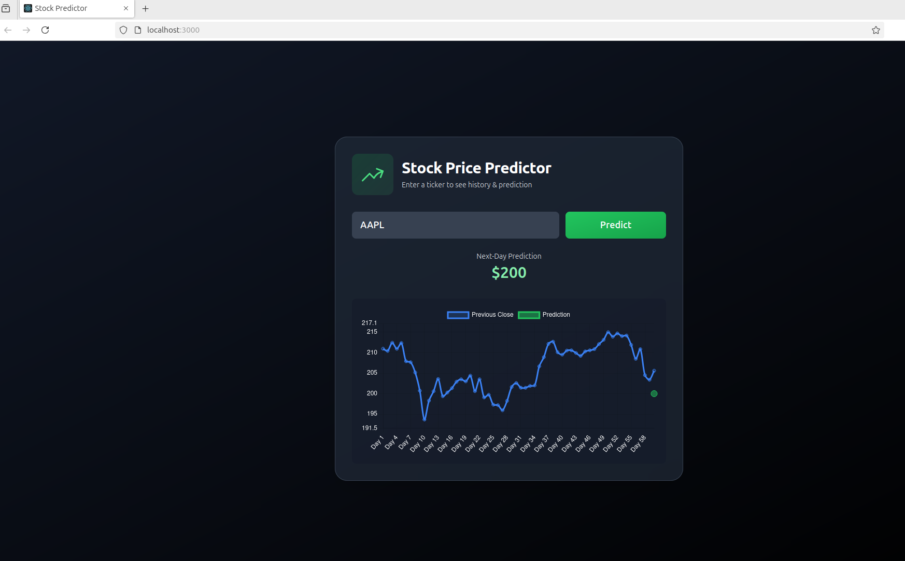

# 📈 Stock Price Prediction & Visualization

A simple end-to-end project combining **Data Science (Python, TensorFlow)**, **C++ (ONNX Runtime for inference)**, and a **React frontend**.

- **Python**: Fetch stock data, train LSTM, export to ONNX
- **C++**: Serve predictions over HTTP
- **React**: User interface to query predictions

---

## 🚀 Features

- Fetches live stock data using [yfinance](https://pypi.org/project/yfinance/)
- Trains a simple **LSTM model** for next-day price prediction
- Exports model to **ONNX** for fast inference in C++
- C++ HTTP server serves predictions at `/predict` endpoint
- React frontend queries the server and displays predictions

---

## 🗂 Project Structure

```
stock-predictor/
├── ingest_train/       # Python data + training
│   ├── fetch_and_save.py
│   ├── train_export.py
│   └── model/          # saved ONNX models
├── cpp_server/         # C++ inference server
│   ├── main.cpp
│   ├── CMakeLists.txt
│   └── Simple-Web-Server/
├── frontend/           # React frontend
│   ├── src/
│   │   └── App.js
│   └── public/
└── README.md
```

---

## ⚙️ Setup & Usage

### 1. Python (Data + Training)

```bash
cd ingest_train
python3 -m venv venv
source venv/bin/activate
pip install yfinance pandas tensorflow tf2onnx

# Fetch stock data
python fetch_and_save.py AAPL data/AAPL.csv

# Train model and export to ONNX
python train_export.py data/AAPL.csv 10 model/lstm.onnx
```

---

### 2. C++ Server (Inference API)

```bash
cd cpp_server
mkdir build && cd build
cmake ..
make

# Run server
./stock_server ../AAPL.csv 60 8080
```

Server runs at:  
`http://localhost:8080/predict?ticker=AAPL`

---

### 3. React Frontend

```bash
cd frontend
npm install
npm start
```

Frontend runs at:  
`http://localhost:3000`

---

## 🎨 Frontend Preview



---

## 📌 Roadmap

- [ ] Add support for multiple tickers dynamically
- [ ] Improve model accuracy with more features (volume, indicators)
- [ ] Deploy via Docker

---

# 🧪 Testing Different Models for Stock Prediction

In this project I've also tried implementing different **ML models and parameters** to predict stocks.  
For this experiment, I used data from Yahoo Finance for **TATA MOTORS**.

## 📊 Results from `Stock_Prediction.ipynb`

### 🔹 RNN using LSTM:

  
The graph may not look very impressive, but with a higher range of data and better optimizations, the model can perform much better.

### 🔹 Linear Regression:

  
The results in this case are quite impressive; however, this might be because the model is not predicting that far into the future, which makes it uncertain how well it will perform in practice.

### 🔹 ARIMA:

  
In ARIMA, you get an interval within which the future value is expected to lie.

---

## 📊 Results from `Stock_Prediction_Diff_Parameters.ipynb`

To further improve the model, I tried adding some benchmarks, such as 'NIFTY'.

### 🔹 Gradient Boosting:


### 🔹 Linear Regression with more parameters:

  
This is nearly the same as the previous one, with no visible improvements.

---

## ✅ Conclusion

1. **RNN (LSTM):** Suited for **medium-term stock purchases**. With optimizations or longer data ranges, it can perform much better.
2. **Linear Regression:** Very strong for **short-term predictions**, but uncertain for long-term performance.
3. **ARIMA:** Provides an **interval** for future prices, useful for long-term investment strategies.
4. **Gradient Boosting:** Decent for **medium time frames**, but not optimal for very short-term predictions.

---

## 🔮 Future Work

1. Study seasonal effects on the stock market.
2. Perform **sentiment analysis** to see how news and social media affect stock prices.
3. Examine macroeconomic factors (US bond rates, gold prices, etc.).
4. Explore technical indicators like **RSI** and **EMA** to enhance predictions.
